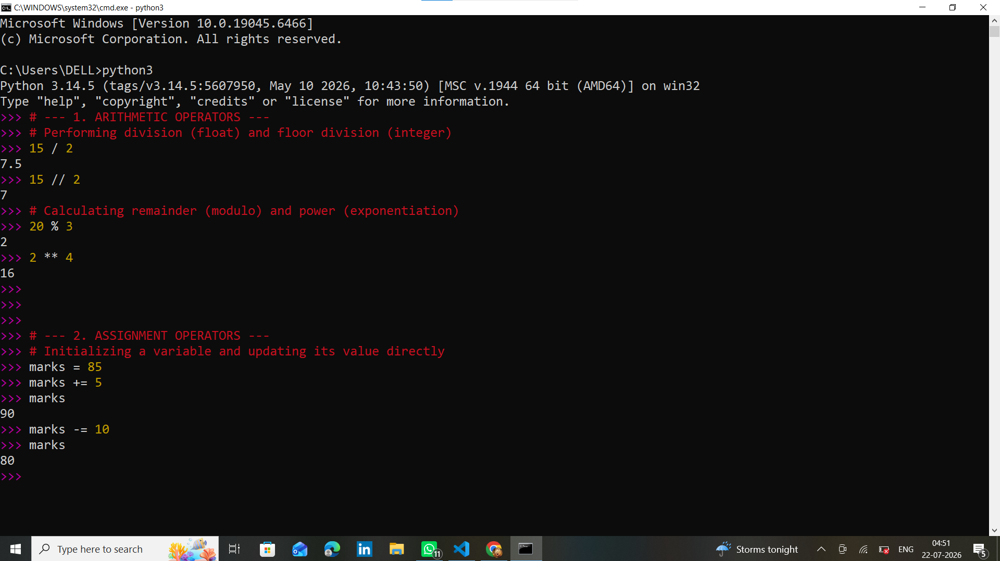
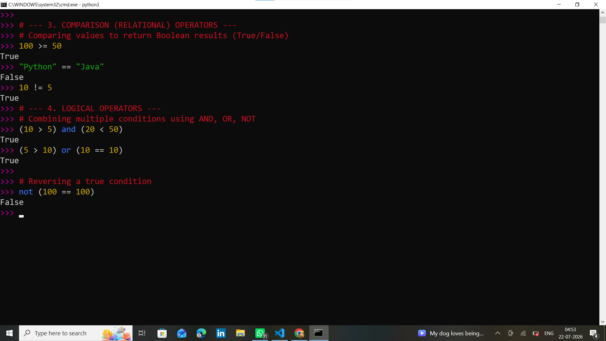
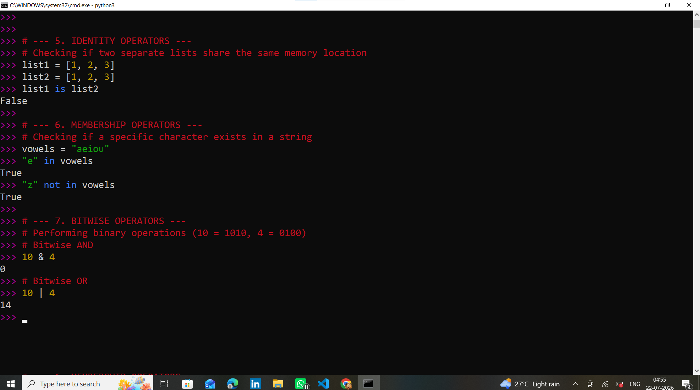

# Practical 01: Introduction to Python, Interactive Shell, and Operators
**Date:** July 22, 2026
**Presented by:** Somwanshi Vedant Siddheshwar

### 1. Theory on Python
Python is a high-level, interpreted, and dynamically typed programming language. Created by Guido van Rossum, it is designed with a strong emphasis on code readability, largely using significant indentation. Python supports multiple programming paradigms, including procedural, object-oriented, and functional programming, making it highly versatile for tasks ranging from basic scripting to complex web development and artificial intelligence.

### 2. Theory on Interactive Shell
The Python Interactive Shell (often referred to as REPL: Read-Evaluate-Print-Loop) is a command-line environment that allows developers to execute Python code statement by statement. When a command is entered, the shell reads it, evaluates the expression, prints the result directly to the console, and loops back to wait for the next command. It is highly useful for debugging, testing logic quickly, and learning without the need to save a `.py` file.

### 3. Types of Operators in Python (7 Types)
Operators are special symbols that carry out arithmetic or logical computation. Python supports the following 7 categories of operators:

1. **Arithmetic Operators:** Perform mathematical operations (`+`, `-`, `*`, `/`, `//`, `%`, `**`).
2. **Assignment Operators:** Assign values to variables (`=`, `+=`, `-=`, `*=`, etc.).
3. **Comparison (Relational) Operators:** Compare two values and return a boolean (`==`, `!=`, `>`, `<`, `>=`, `<=`).
4. **Logical Operators:** Combine conditional statements (`and`, `or`, `not`).
5. **Identity Operators:** Check if two variables point to the same object in memory (`is`, `is not`).
6. **Membership Operators:** Test if a sequence is presented in an object (`in`, `not in`).
7. **Bitwise Operators:** Perform bit-level operations (`&`, `|`, `^`, `~`, `<<`, `>>`).

### 4. Interactive Shell Execution Outputs
*(Below are the screenshot evidences of executing all 7 operator types directly in the Python Interactive Shell without using the print function).*

