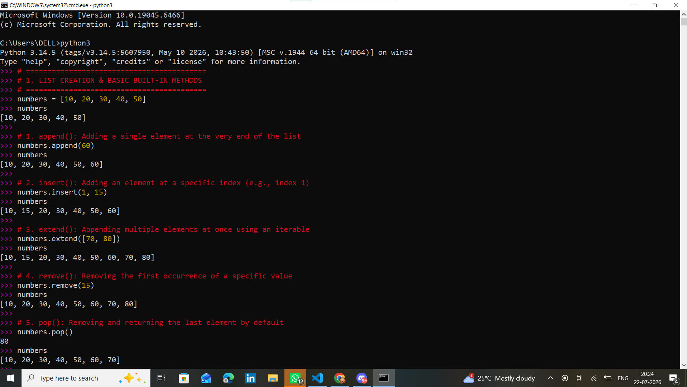
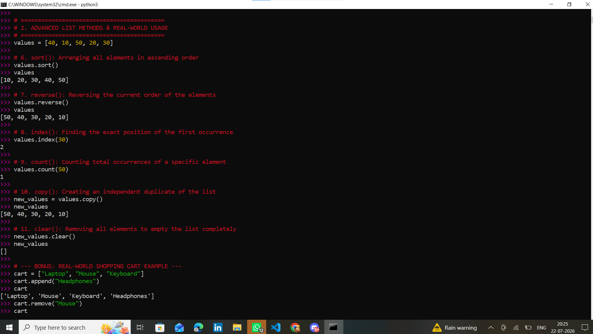
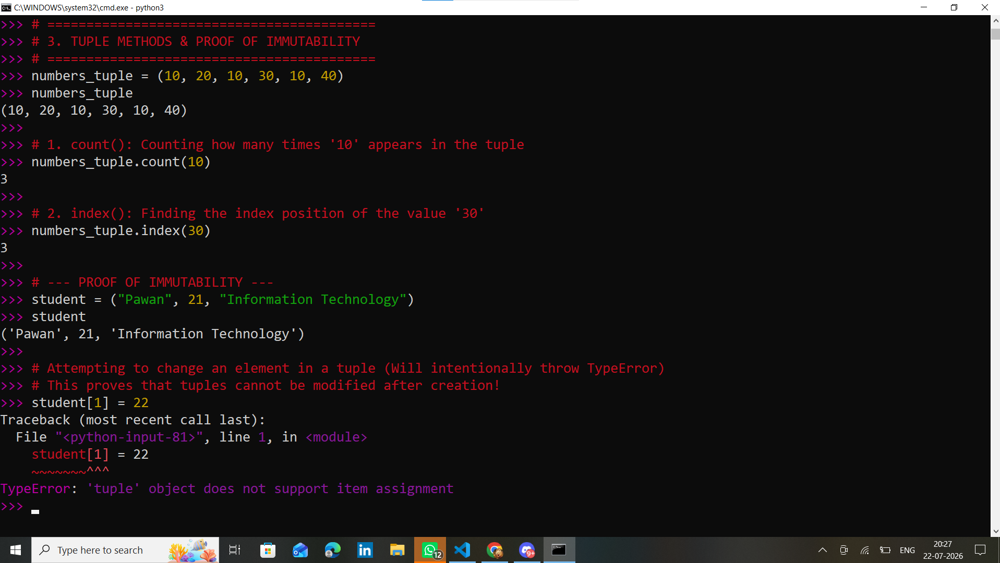
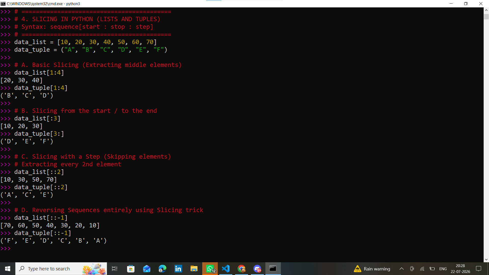

# Practical 2: Study of List and Tuple Built-in Methods and Slicing in Python

**Name:** Somwanshi Pawan Siddeshwar

## 1. Aim
To study and implement the built-in methods of List and Tuple and understand the concept of Slicing in Python.

---

## 2. Theory of List in Python
A List is an ordered collection of elements in Python. It is used to store multiple values in a single variable. A list can contain elements of different data types such as integers, strings, floating-point numbers, and even other lists. Lists are created using square brackets `[ ]`.

**Characteristics of Lists:**
* Lists are ordered and mutable.
* Lists allow duplicate elements and can store different data types.
* Lists support indexing, slicing, and have several built-in methods.

---

## 3. List Built-in Methods
| Method | Description |
|---|---|
| `append()` | Adds an element at the end |
| `clear()` | Removes all elements |
| `copy()` | Returns a copy of the list |
| `count()` | Counts occurrences of an element |
| `extend()` | Adds multiple elements |
| `index()` | Returns the index of an element |
| `insert()` | Inserts an element at a specific position |
| `pop()` | Removes and returns an element |
| `remove()` | Removes a specified element |
| `reverse()` | Reverses the list |
| `sort()` | Sorts the list |

### List Methods Execution

---

## 4. Theory of Tuple in Python
A Tuple is an ordered collection of elements in Python. Tuples are created using parentheses `( )`. The most important feature of a tuple is that it is **immutable** (cannot be changed, added, or removed after creation).

**Characteristics of Tuples:**
* Tuples are ordered and immutable.
* Tuples allow duplicate elements and can contain different data types.
* Tuples support indexing and slicing.

### Tuple Methods Execution

---

## 5. Slicing in Python (Lists and Tuples)
Slicing is used to extract a specific portion of a sequence. 
* **Syntax:** `sequence[start : stop : step]`

### Slicing Execution

---

## 6. Result & Conclusion
The built-in methods of List and Tuple were studied and successfully implemented. Various list methods (`append`, `insert`, `extend`, `remove`, `pop`, `sort`, `reverse`, `index`, `count`, `copy`, `clear`) and tuple methods (`count`, `index`) were performed. Slicing was successfully performed on both lists and tuples to extract specific portions of sequences. This practical helped in developing a clear understanding of Python's sequence data structures and their commonly used operations.